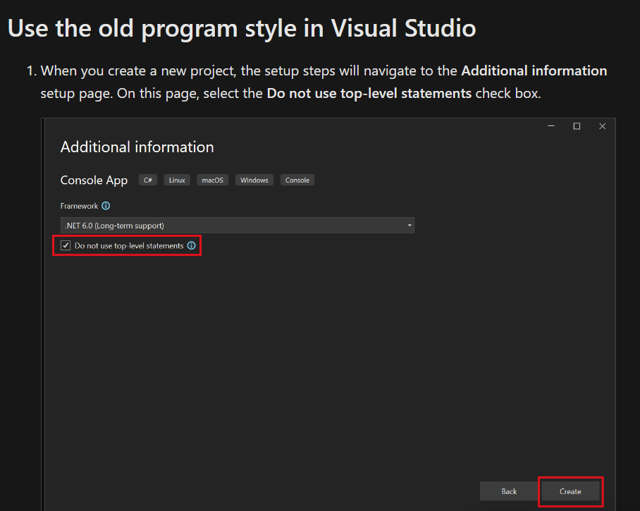

# C# console app template generates top-level statements

Starting with .NET 6, the project template for new C# console apps generates the following code in the Program.cs file:

```csharp
// See https://aka.ms/new-console-template for more information
Console.WriteLine("Hello, World!");
```

The new output uses recent C# features that simplify the code you need to write for a program. For .NET 5 and earlier versions, the console app template generates the following code:

```csharp
using System;

namespace MyApp // Note: actual namespace depends on the project name.
{
    internal class Program
    {
        static void Main(string[] args)
        {
            Console.WriteLine("Hello World!");
        }
    }
}
```

These two forms represent the same program. Both are valid with C# 10.0. When you use the newer version, you only need to write the body of the Main method. The compiler synthesizes a Program class with a Main method and places all your top level statements in that Main method. You don't need to include the other program elements, the compiler generates them for you. You can learn more about the code the compiler generates when you use top level statements in the article on top level statements in the C# Guide's fundamentals section.

You have two options to work with tutorials that haven't been updated to use .NET 6+ templates:

- Use the new program style, adding new top-level statements as you add features.
- Convert the new program style to the older style, with a Program class and a Main method.

# How to define a function in Top-level statements

```csharp
using System;
Console.WriteLine("toplevel");
ThisShouldBeAMethodOfProgramClass();

static void ThisShouldBeAMethodOfProgramClass()
{
    Console.WriteLine("Static in Program class");
}
```

# How to disable Top-level statements:

<p align="center">

</p>